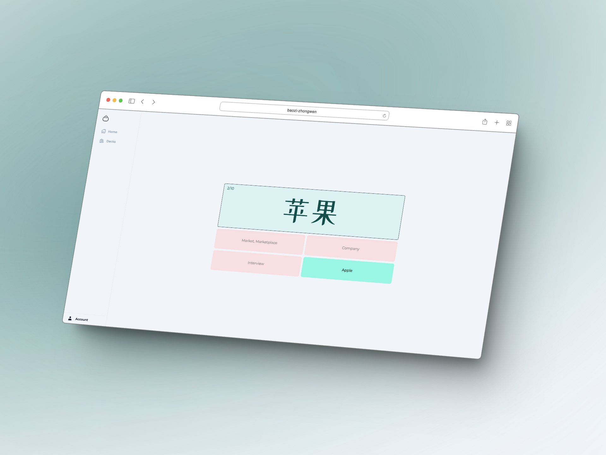

# Dumpling Chinese (Baozi Zhongwen/包子中文)

__🚧 Note: This is a WIP 🚧__

A web app for learners of Mandarin Chinese.

## Overview

This Golang application uses the following:

- [Echo](https://echo.labstack.com/)
- [Goose](https://github.com/pressly/goose)
- [Jet](https://github.com/go-jet/jet)
- [Templ](https://github.com/a-h/templ)
- [HTMX](https://htmx.org/)
- [TailwindCSS](https://tailwindcss.com/)
- [Alpine.js](https://alpinejs.dev/start-here)
- [Docker](https://www.docker.com/)
- [Postgres](https://www.postgresql.org/)

## Feature list
### Auth
- [X] Login
- [X] Register
- [X] Email verification
- [ ] Forgot password

### Decks
- [X] Create deck
- [X] View deck
- [X] Edit deck

### Cards
- [X] Add card to deck
- [X] Edit card
- [ ] Delete cards

### Study
- [X] Complete study session
- [X] View study session summaries
